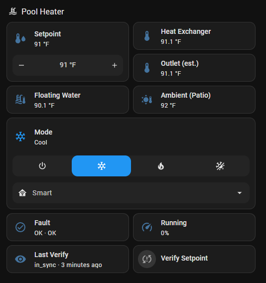

# The °F keeper — 1 °F setpoint resolution in Home Assistant

This guide runs the unit's display in **°F mode** permanently and gives
Home Assistant true 1 °F setpoint control with closed-loop verification.
Read [FIRMWARE-NOTES.md](FIRMWARE-NOTES.md) first to understand *why* it's
built this way: in °F mode the setpoint works in °F integers but the
firmware never reports it back, so **HA must be the bookkeeper**.

If you're happy with 2 °F granularity, skip all of this: leave the display
in °C and the plain tuya-local climate entity is fully coherent.



## Architecture

- `input_number.pool_heater_setpoint_f` — the ONLY setpoint truth
  (59–104 °F, step 1, survives restarts).
- An automation pushes every change **raw into dp2** via a small bridge
  script (tuya-local never touches the setpoint; conveniently, stray
  climate-card setpoint writes are inert in °F mode because the controller
  discards sub-59 values).
- A **verify cycle** audits the unit on a schedule and on demand: flip the
  unit to °C (the firmware then publishes its true setpoint once), read
  it, flip back to °F, re-write the intended value. Drift — someone
  changed the setpoint at the unit's display — is **adopted** (the display
  edit is the newer human intent), synced back into the input_number, and
  announced by phone notification.
- A mode-proof template sensor recovers the true water temperature from
  the °F-poisoned climate attribute, in either display mode.

## Install

1. **Device config**: the unit must be on tuya-local with the included
   device config — [SETUP.md](SETUP.md) covers that end to end, local key
   included. Keep the °C config — do NOT modify it for °F; the keeper
   handles everything.

2. **Bridge**: copy [heater_bridge.py](heater_bridge.py) to
   `/config/tuya_bridge/heater_bridge.py` and vendor tinytuya next to it
   (from any shell on the host — e.g. the SSH add-on):

   ```bash
   mkdir -p /config/tuya_bridge/lib
   python3 -m pip install --target /config/tuya_bridge/lib tinytuya
   ```

   Living under `/config` it survives both HA core and add-on updates.

3. **Secrets** — add to `/config/secrets.yaml`:

   ```yaml
   tuya_pool_heater_id: <device id>
   tuya_pool_heater_key: <local key>
   tuya_pool_heater_host: <device IP — give it a DHCP reservation>
   ```

4. **HA config**: merge the snippets in [ha/](ha/) —
   `configuration.yaml` (shell commands + verdict sensor), `scripts.yaml`
   (the verify script — set your own notify service), `automations.yaml`
   (setpoint writer + verify schedule), `templates.yaml` (water temp
   sensor). Create the input_number helper (Settings → Devices & Services
   → Helpers → Number: 59–104, step 1, °F). Restart HA.

5. **Prime and commission**: set the input_number to the setpoint currently
   on the unit's display, flip the display to °F (at the unit, or
   `python3 /config/tuya_bridge/heater_bridge.py flip f`), then run the
   verify script once — expect `in_sync`.

6. **Dashboard**: add the section in
   [ha/dashboard-section.yaml](ha/dashboard-section.yaml).

## The card, tile by tile

| Tile | What it shows / does |
|---|---|
| **Setpoint** | The target, in °F, 1 °F steps. **The only place to set temperature.** Lands on the heater within ~2 s. |
| **Heat Exchanger** | dp3 corrected to true °F. Settled behavior: at rest it relaxes to true water temp in a few minutes; under load it is an **outlet-side** reading — matches the display's outlet while heating, ~1.5 °F below it while cooling. "What's leaving the exchanger", not "what the pool is". |
| **Mode** | Off/Cool/Heat/Auto + gear dropdown (Quiet/Smart/Quick). Safe to use. **Don't set temperature from this tile's pop-up** — its numbers are °F-poisoned; such writes are harmlessly ignored. |
| **Fault** | Latched fault code exactly as the unit's display shows it (`OK`, `E3`, …) with the manual's description. Latches on the first pulse, clears 15 s after true recovery — never flickers. |
| **Running** | Compressor output %. Quick gear legitimately exceeds 100. |
| **Last Verify** | Latest audit result — `in_sync` / `drift_adopted` / `read_failed` — and how long ago. |
| **Verify Setpoint** | Tile; tap to run the ~15 s audit (icon lights while it runs). |

## One verify, play by play

1. HA hands the bridge the Setpoint tile's current value.
2. Bridge flips the unit to °C — **the display blinks °C; this is
   normal** — and the firmware publishes the controller's actual setpoint.
3. Bridge reads it and compares (±1 °F, the conversion's inherent blur).
4. Flips back to °F (this slightly corrupts the register — firmware
   quirk), so it always finishes by…
5. …re-writing the correct °F setpoint raw: HA's value if they agreed,
   the display's value if someone changed it at the unit.
6. Verdict → Last Verify tile; `drift_adopted` also updates the Setpoint
   tile and notifies your phone; `read_failed` notifies. `in_sync` is
   silent.

The scheduled runs (default: hourly on the hour — which also repairs a
°C reversion after a power blip within the hour) are the same sequence.

## House rules

1. Set temperature from the Setpoint tile. Nowhere else.
2. Changing it at the unit's display is fine — HA adopts it at the next
   verify (or tap Verify). A 1 °F display edit may be silently unified
   (below the audit channel's ±2 °F resolution).
3. Never change °C/°F at the display. If a power cycle ever reverts the
   unit to °C, the next verify's flip-back repairs it automatically.
4. Power outages self-heal: HA re-pushes the setpoint on startup.

## Limitations

- Drift detection resolves to ±2 °F (the audit channel is integer °C).
- Wall setpoint edits are invisible between verifies (°F-mode firmware).
- Each verify blinks the display to °C for ~10 s.
